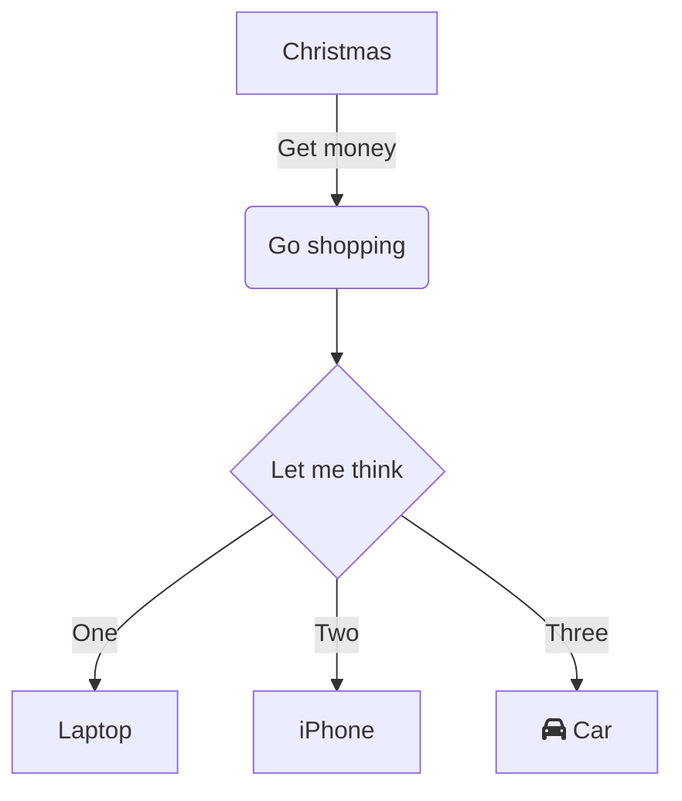

---  
category: 잡동사니 🧸  
share: true  
date created: Monday, January 16th 2023, 3:20:49 pm  
date modified: Wednesday, January 18th 2023, 4:41:28 pm  
---  
# how to use Obsidian   
이모티콘 컨트롤 커맨드 스페이스바   
[영상 출처](https://youtu.be/wKNWMBeGCuU)  
1. 단어 누르고 cmd + K -> [링크]() 생성   
2. edit mode에서만 마크다운 비쥬얼 보임  
3. current view에서 new pane 보임 (cmd 누르고 안경)  
4. 키보드 단축키 = 설정에 hot keys에서 커스텀 가능  
	->  가장 많이 쓰는 단축키:   
	- cmd E (edit prv mode 왔다리 하는 것)  
	- cmd shift F 모든파일에서 검색  
5. cmd p 는 진짜 제일 중요한거 모든 기능 다 쓸수잇음  
6. dragging panes: 걍 ui 커스텀 가능함  
7. **bold**  
8. *italic*  
9. ~~strikethrought~~  
10. ==hightlight==  
11. - dashes  
12. cmd/ctrl [ 아니면 ] : change indentation  
13. *To-do-list*  
```  
- [ ] task 1  
```  
15. Blockquotes  
	> hello world  
15. dividers  
---  
17. cmd 누르고 노트 여러번 누르면 동일한 창 여러번 뜸  
18. home Note: 자주쓰는 노트만 백링크로 모은 페이지, 자주 쓰는 페이지에 홈노트 링크를 추가한다.  
19. 자주 쓰는 노트를 사이드바로 옮길 수 있다.  
20. tag 기능도 지원 서칭할 때 편함  
	-> 태그별로 리스트화 하는 플러그인: core plugin 들어가서 tag pane 활성화 (오른쪽 사이드바에서 확인 가능)  
```  
	 `#tag/hello  
	`# tag/hello/cute`  
	`# tag  
```  
21. 템플릿 활용: core plugin에 가서 Templates 버튼 활성화  
22. starred notes: core plugins 에서 starred 활성화 -> 사이드바에 활성화  
23. Attachments -> 첨부파일이 많으면 파일 하나 만들어서 우클릭 후 set as attachment folder 로 지정  
24. 제텔카스텐 플러그인 (코어플러그인에서 활성화하기) ~ 사이드바에 생김, 현재 날짜 시간이 제목에 입력됨  
25. Audio recorder -> 코어 플러그인에 이승ㅁ  
26. attachments Folder ~~  
27. 상단 점 세개 부분 누르면 스플릿뷰 선택 가능  
  
28. Link to headings:   
```  
[[How to use Obsidian 🧸#제목]]  
```  
30.   
  
#### 제목  
29. 디폴트 뷰 변경: cmd p -> toggle defualt view 변경  
30. find and replace: cmd p -> search & replace in current file  
31. code block: 언어도 지정 가능  
```py  
code  
```  
  
```js  
code  
```  
32. `backticks` hello  
33. outline: 코어플러그인에서 활성화   
-> ==sidebar에서 모든 heading을 확인할 수 있음==  
34. footnotes: 주석달기 `[^1]  
  
36. multiple cursors: 옵션키 누르고 클릭 (vss에서도 써먹는거)  
37. Link with aliases: 제목이 너무 길 경우 | 사용  
```  
[[commit push|overview]]  
```  
  
37. resize image 이미지 사이즈 조절  
![[../images/images.jpeg|100]]  
  
38. link to Blocks -> ^ 사용  
```shell  
[[the name of the notes^]]  
[[hello#^49ba79|link blocks]]  
[[hello#^6e8048|fatal]]  
[[01. 데이터베이스 준비하기#^0e9202]]  
```  
무슨 파일에 그 블락이 있는지 모를 때, ^^ 먼저 치고 문단 검색  
```  
[[hello#^49ba79]] ~ ^^ oh my me  
```  
  
39. Query Blocks:   
```   
// type: query  
tag: #tag/hello   
```  
어떤 새로운 노트라도 저 태그로 지정되어 있으면 여기로 나타남   
40. Templates snippets: 템플릿만들때 필요한 스니펫 ~ ex. {(Date: MMM D, YYYY)} -> 현재시간으로 바뀜  
  
41. Iframes 지원함  
<iframe width="560" height="315" src="https://www.youtube.com/embed/wKNWMBeGCuU" title="YouTube video player" frameborder="0" allow="accelerometer; autoplay; clipboard-write; encrypted-media; gyroscope; picture-in-picture" allowfullscreen></iframe>  
42. Tables: | 와 - 로 만듬  
   
안녕 | 하세요  
----|------  
반갑 | 습니다  
  
43.   다이어그램, 차트 -> [mermaid]([Online FlowChart & Diagrams Editor - Mermaid Live Editor](https://mermaid.live/edit#pako:eNpVkE1qw0AMha8itEohvoAXhcZOsgmk0Ow8WQiPnBmS-WEsU4Ltu3ccU2i1kt77nhAasQ2ascRbomjgUisPuT6ayiTbi6P-CkXxPh1ZwAXPzwl2m2OA3oQYrb-9rfxugaAaTwvGIMb6-7xa1St_9jxB3ZwoSojXv87lO0ywb-ynyev_OyZxTh2ajsqOipYSVJReCG7RcXJkdT59XBSFYtixwjK3mjsaHqJQ-TmjQ9QkvNdWQsJS0sBbpEHC19O3v_PK1JbyI9wqzj8k-lxH)) 사용해서 복붙하면 됨  

  
  
44.   
---  
깃허브 사용하는데 PC에서는 옵시디언 플러그인이 있습니다. 아이폰에서는 Working Copy로 깃허브에 있는 내용을 가져올 수 있어요.    
    
PC간에는 dropbox 류의 파일 sync를 써도 됩니다.    
    
css로 커스텀 가능하고 유용한 플러그인이 많으며 무엇보다 파일을 모두 로컬에 가지고 있어서 속도 문제가 전혀 없습니다.  
  
저도 Bear 로 한번 정리하고 Obisidian 으로 개인 위키를 만들고 있는데, Obsidian 이 계속 업그레이드 되면서 너무 마음에 들어요.    
IPad에 모바일 버전도 깔아서 동기화하여 쓰는 것에, Excalidraw로 애플팬슬로 노트까지 되니, 정말 완전체가 되어 가더군요.  
  
  
  
  
  
[노션]    
- 예쁨, 표 활용이 좋음, 최근 api 열어줌, 다른 앱과의 호환 좋음, 좀더 간편함, 계정 동기화, 협업 용이    
- 파일 백업에 어려움 (서비스 중단, 변경시), 화면 꾸미기에 집중하게 됨, 노트를 어디에 정리해야할지 고민됨, 태그 안됨, 백링크 부족, 빠르게 노트생성 불편, 폰에서 느림, 노션 자체에서 개발안해주면 커스텀화&기능추가 어려움    
    
[옵시디언]    
- 개인이 만든 플러그인을 활용한 다양한 기능 사용 가능, 백링크&그래프뷰 기능 좋음, 아이폰 단축어로 빠르게 노트 추가(형식도 간단히지정가능), 백업 용이 (서비스 중단해도 마크다운 호환되는 다른 앱 사용하면 됨), 폴더 및 파일 정리 신경 안쓰게 됨, 태그 가능    
- 노션보다 학습 곡선 높음(플러그인 공부부터..), 다양한 기능을 사용하고 싶다면 초보에게 조금 부적합, 노션보다 안예쁨, 협업과 publish 보다는 개인용 노트, 아이폰 sync이 무료의 경우 icloud만 지원 (여러 기기에서 사용시 syncthing 등의 추가 유틸 필요)    
    
개인적으로 노션은 협업, 공개용, 표를 사용한 내용 정리 등으로 좋고    
옵시디언은 나의 여러 생각을 빠르게 입력하고 그 생각을 연결시키는데 좋다고 느꼈습니다  
  
[^1]: 이런 방식으로 사용